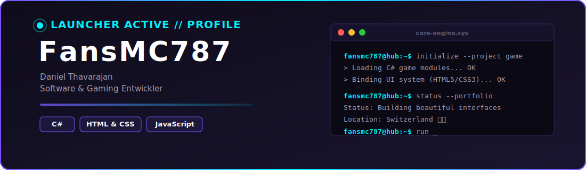
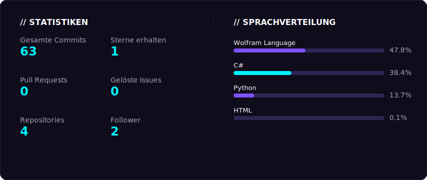

  

 

## Hoi! Ich bin Daniel Thavarajan 👋

Willkommen auf meinem GitHub-Profil! Ich bin ein leidenschaftlicher **Software- und Gaming-Entwickler** aus der Schweiz. Ich liebe es, interaktive Welten zu erschaffen, performanten Code zu schreiben und moderne Web-Interfaces zu designen. Inspiriert von packenden Gaming-UIs verbinde ich Kreativität mit sauberem Code.

---

### 🛠️ Technologien & Skills

<table width="100%">
  <tr>
    <td width="50%" valign="top">
      <strong>Core Languages & Gaming</strong> 
      • <code>C#</code> (Unity / Core Development) 
      • <code>JavaScript</code> (Interaktive Logik)
    </td>
    <td width="50%" valign="top">
      <strong>Web Development</strong> 
      • <code>HTML5</code> & <code>CSS3</code> (Modernes UI/UX) 
      • Responsive & Clean Web Designs
    </td>
  </tr>
</table>

---

### 🎮 Aktuelle Projekte

* **Game Project (In Development):** Ein eigenständiges Spieleprojekt, in dem ich Gameplay-Mechaniken, Physik und Logik in C# von Grund auf aufbaue.
* **Portfolio-Webseite:** Mein persönliches Aushängeschild im Web. Clean, modern und vollgepackt mit interaktiven Details, um meine Arbeiten zu präsentieren.

---

### 📊 Meine GitHub-Statistiken

  

---

### 📬 Kontakt aufnehmen

Falls du Fragen zu meinen Projekten hast oder einfach nur über Gaming und Software-Entwicklung quatschen möchtest, erreichst du mich hier:

* 📧 **E-Mail:** daniel.thavarajan@gmail.com
* 📞 **Telefon:** +41 77 964 48 90

---

  Interessiert an Code? Schau dich gerne in meinen Repositories um! ⚡ Erzeugt mit automatisierten GitHub Actions.

